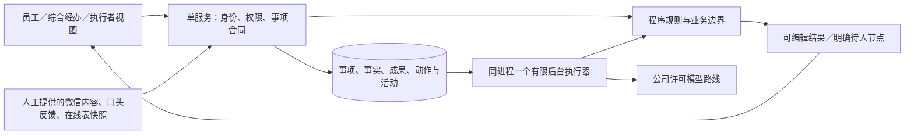

# 持续助理架构方案

版本：2026-10-08 / V0.1 架构草案，基于 PRD V1.6。对应 T-003 / T-015，采用 Africa/Lagos 的用户日期。

状态：第1–9节保留此前草案与正式业务限制；后续授权及本地准备层实施选择见第10节。v0.1局部实现已完成工程验证，仍不代表完整技术/业务定稿或真实模型可用。实际证据以任务清单及工程验证记录为准。

## 1. 输入、范围与变更

权威输入：[PRD](../product/PRD.md)第1、3、5、6、10–12节，[用户确认](../product/用户确认.md)，[任务清单](../product/任务清单.md)。[UX方案](../design/UX方案.md)负责界面与交互；本文负责后端可验证合同。冲突交回产品和 Leader，不通过技术设计改业务规则。

2026-10-08最新用户信息：实际经理安排、经办办理；产品流程按一个综合经办主体设计。现渠道为微信、口头、在线 Excel，具体在线平台、接口、权限和权威字段未核。用户只确认“繁琐”，未给完整实例、频次或耗时。由此减少内部转交建模，不引入经理审核步骤、不共用个人账号，也不取消原安全批准、实际执行等职责。

本草案建议覆盖**持续助理共用核心＋出行准备及联动边界**。正式首期仍待冻结。其他业务保留在 PRD，不因有共用架构宣称已支持。长期个人偏好记忆 F-027、本次八项与六项额外候选均未选入实现候选；同一事项的上下文、事实与成果保存必须实现，不依赖长期偏好记忆。

用户随后确认当前为竞赛阶段，数据库必须轻量、好部署。由此收敛为单实例 SQLite 候选，不增加独立数据库服务或队列。已确认事实和获授权来源直接复用，用户只修变化、补阻断项；可靠性通过程序约束和后台保存实现，不让每一步再确认。竞赛详细要求仍待Q-017，不推定赛事指标。

本目录当前仅有项目文档，无应用源码、依赖、既有 API 或运行数据库可复用。已有用户确认、需求与编号继续使用；无既有应用/数据库迁移或兼容改造对象。本轮未执行迁移，后续正式数据接入另核授权。

## 2. 最少结构与取舍

拟选一个 Web 应用、**一个应用进程＋同进程一个有限后台执行器＋本机 SQLite 文件**。页面关闭不会丢弃已持久登记事项；后台从动作检查点恢复。客户端都经服务访问，不直接打开数据库文件。具体框架、SQLite运行版本、模型、认证方式和部署位置仍待选择/验证，不开启多worker服务进程。

| 设计单元 | 职责与调用方 | 选择理由与代价 |
| --- | --- | --- |
| 事项 | 目标、对话、必要补问、事实修订、等待、下一步、活动和控制；三个授权视图共用 | 以同一事项承接委托，减少重复填报；需处理刷新/重开和并发修改 |
| 事实与权限 | 来源引用、候选/确认、唯一权威映射、字段授权、来源失效、规则版本 | 保证人工修改和真实材料不被模型覆盖；权限与依赖追踪需贯穿成果，不只校验页面入口 |
| 动作执行 | 有限任务、固定工具、预算、幂等、回执、暂停/接手、事务性待执行记录 | 执行检查点和待执行字段共用动作记录，不另建队列服务；需租约、故障恢复和停止栅栏，具体吞吐待验证 |
| 成果与工作视图 | 可编辑结果、已保存版本、复制/导出状态、权限内唯一明细、事项内通知 | 准备清单即可交付，不强制写文稿；导出和共享必须重新检查来源权限 |
| 出行适配 | 独立审批/车辆/实际出返/餐次状态，修订影响，正式规则校验 | 一条完整业务链验证共用核心；业务合同缺失时只准备、不保证派遣或扣餐 |

当前不增加 Redis、Celery、向量库、独立数据库服务器、微服务、通用流程编排器或多智能体框架：当前对象是少量经办与具体目标，分布式配置和通用建模将增加维护负担。仅前端保存会丢持续任务且不能保护并发；仅聊天历史不能区分事实、正式动作和可用成果，因此均不作为主方案。若实际负载或隔离要求超出单实例能力，再以证据评估数据库升级，不能把SQLite文件放网络共享盘来扩容。

SQLite适合本次嵌入式应用/竞赛单实例的候选结构，但同一数据库同时只有一个写者，实际写入负载仍未测。[官方适用场景](https://www.sqlite.org/whentouse.html) 支持该选择及边界（Leader于2026-10-08公开只读核验）。拟先用默认 rollback journal、短写事务；不默认启用WAL。WAL仍是单写者且要求同主机，并增加日志/共享内存及checkpoint管理，只有实测需求再选择。[官方WAL说明](https://www.sqlite.org/wal.html)

### 2.1 少量持久对象与启动候选

持久化围绕六类核心记录：事项、事实修订、来源、成果、动作、事件。后台任务字段与幂等记录放在动作中，规则保存已确认版本/来源快照，不为每个业务另建一套表。账号与必要授权按选定认证方式保留少量独立记录；对话作为有类型的事项事件，不引入全业务人事/车辆/财务总库。

关键可查询/约束字段（事项所属者、当前修订、各轨状态、行版本、动作类型/状态、去重键、租约、事件来源标识）采用明确列与索引/唯一约束；所选行程事实、结果正文及固定类型参数可用经过schema验证的JSON负载。不把所有字段做无限EAV，也不将身份/权限/资源冲突全藏进一段聊天JSON。具体建表与DDL在开发交接前另冻，本轮不创建。

部署候选是一个本地启动入口，或一个容器＋本地持久卷，应用静态资源和服务一起交付；配置仅含运行端口、数据目录、模型许可路线与预算等必要项。数据库和获选源文件置于同一受控数据目录，不装入镜像、不提交Git。启动检查目录可写与schema兼容，恢复持久动作后开始服务；模型未配置时显示等待能力，保留人工输入/编辑/准备路径，外部渠道未接入时保留引用/复制路径。本轮没有启动命令、容器文件或部署测试。

备份拟使用SQLite一致快照备份API，或安全停止全部写者后备份完整数据集；运行中随意复制单个数据库文件不能当可靠备份。[官方备份说明](https://www.sqlite.org/backup.html)（Leader于2026-10-08公开只读核验）。若启用源文件保存，还须备份对应已冻结文件版本并核引用完整性，数据库快照API不替代附件备份；竞赛初期可优先安全停服务后整目录备份。恢复先停服务，校验数据库schema与关联源文件完整性，再启动并核对未决动作，恢复不自动重放外部未知操作。模式升级先留可恢复快照、串行升级、记录版本；失败保留原文件并恢复配套应用/schema版本。没有实库，本轮不执行备份、初始化或升级。

后续可能需要认证、数据库驱动、模型客户端及按已选格式工作的解析组件；当前不新增依赖。每个依赖选定时记录用途、许可、支持版本、维护方、故障退化与目标环境实测；附件/OCR/语音不作为文字最低路径的前置条件。

## 3. 权威、身份与信息边界

### 3.1 唯一维护位置

Q-001须逐项冻结“业务对象/字段 → 权威记录位置 → 原记录标识 → 维护者 → 读写方式”。同一字段的本地保存是候选或有时间标记的引用快照，不能成为第二份独立总账。若确认本应用是某项记录的唯一维护处，再启用该项正式写入；不能仅因导入一张表就宣布接管。

微信内容由获授权者粘贴/提供，口头反馈由经办记录并注明实际陈述人，在线 Excel 由获授权者提供选定记录/快照或引用。此路径不包括读取群聊、微信机器人、自动发送、实时读取在线表或双向同步。平台与接口未知时不猜供应商。

导入须有原记录标识、范围/期间、读取时点和来源版本；没有稳定标识只产生匹配候选。更新形成差异候选，缺行不删除、空白不默认清空、较旧快照不覆盖较新确认。人工核对沿原职责，不另建每次导入审批。对账和搬运耗时纳入净减负验证。

### 3.2 授权合同

服务端根据实际账号、事项范围、字段/来源和动作授权每次读取与修改。员工默认只有本人私有目标及材料；综合经办只看被授予业务范围；司机只看必要乘车、地点、时间、联系与本人派遣/反馈；食堂只看必要餐次汇总及饮食约束。没有真实授权数据时只设计/测试隔离，不开放现场协同。

“参与者、系统管理员、职位”均不是自动业务权限。查看、修改事实、登记反馈、核对回执、派遣等动作分别检查。AI工具不是身份来源，只能使用本次目标已获授权且仍有效的范围；来源中的指令作为数据，不产生权限或执行授权。

代录保留 `reported_by`（实际陈述/反馈人）与 `recorded_by`（当前账号），不伪装司机或审批人登录。经办登记“某人称已批准”只是一条声明；按Q-002核过真实凭据后才可形成对应批准事实，不增加内部审批层。

撤权增量更新权限版本，立即阻止后续读取/下载/导出与未执行动作。成果保存其所依赖来源及敏感字段范围：默认继承限制，不因摘要或复制预览放宽；若需要对司机/食堂给必要字段，应由确定的字段投影生成单独成果，不能靠模型自行判断可公开。缓存不得绕过权限；历史保留给有权者，无法收回已经下载的文件。

## 4. 共用数据合同

以下为逻辑合同，非已创建数据表。内部标识采用不可猜测 ID；持久行版本为递增整数。字段未确认可为 `null`，同时给出 `status: unknown` 及原因，不能用0、空列表或“否”冒充已知。确认记录只能由相应获权主体产生。

| 对象 | 最少字段与约束 |
| --- | --- |
| 事项 Matter | `id, owner_id, goal_text, domain, version, control_epoch, assistant_status, preparation_status, business_status, waiting[], next_steps[]`；默认私有；代办、准备成果与业务办结独立。等待项有原因/对象或“对象待核”，不造姓名与截止时间 |
| 事实修订 FactRevision | `matter_id, revision_no, fields, base_revision, confirmed_by/at`；每字段保留值、语义、候选/本人或授权者确认/来源引用/程序派生、来源引用；新修订不删旧事实，实际时间不覆盖计划时间 |
| 来源 SourceRef | `origin: user_text/manual_statement/manual_reference/snapshot/verified_connector, locator, external_record_id?, source_version?, observed_at, recorded_by, reported_by?, readable_scope, access_policy_version`；未核接口不能标 `verified_connector`；引用无原文时明确可核范围不足 |
| 规则 RuleVersion | `rule_key, version, scope, effective_from/to?, confirmed_by/at, source_refs, executable_conditions`；未冻规则不能执行正式判断；未知/冲突是结果而非默认通过 |
| 动作 Action | `id, matter_id, kind, revision_no, rule_versions, permission_version, control_epoch, status, idempotency_key, attempts, external_ref?, last_error`；固定动作白名单，禁止模型提供任意脚本/SQL或地址进行写入 |
| 动作内执行字段（逻辑 Job） | `step, next_run_at?, attempt_limit, budget_ref, lease_owner/until, checkpoint`与Action共存；等待真人时不循环催问/调用模型；到时事件只唤醒允许的步骤，租约失效后按检查点恢复，不单独部署worker或建任务库 |
| 活动 Activity / 业务事件 | `event_id, matter_id, actor_id, recorded_by, reported_by?, event_type, occurred_at?, recorded_at, revision_no, source_refs, result, correlation_id`；记录可观察动作、错误、真实声明/回执，不记录或展示模型隐性思维；声明、凭据核对、正式结果分类分开 |
| 成果 Artifact | `id, matter_id, type, version, content, input_revision, source_dependencies, human_edits, status, access_policy`；模型新稿与人工保存版本分开，未经选择不覆盖；保存/复制/导出与外部提交/接受独立 |
| 出行 Travel | 共用确认人员/地点/用途/计划离返营及语义时间；审批、车辆、实际出返、餐次四轨各有状态、适用修订与来源；批准范围未知时不能判新修订可执行 |

日期时间：瞬时时间存 UTC 并保留原文、原时区、当地日期及含义（离营/航班起飞/返营），展示使用获确认的业务时区。本会话用户日期为 Africa/Lagos；其他地点与餐次时区仍待Q确认。相对日期依据输入时的日期/时区形成候选，须明确具体日期，不能用服务器时区或航班时间代替离营时间。记录时间与事实发生时间分开，迟到反馈可以补录。

数量/金额若未来启用，用十进制字符串加单位/币种/期间；缺数保持未知，多币种不相加。餐次键按 `person_id + local_date + meal_code + rule_version` 明确语义，实际去重按同人员同餐次；不同规则版本不是重复减人依据。

成果和确认记录保存所依赖的字段/来源/规则版本。事实更正或来源换版只使受影响检查“待重核”，其他人工修改保留；旧批准不改写，当前适用性另记。保留/删除/更正期限待Q-011，不在本草案预设法律保留年限。

## 5. 可验证接口与错误

下表是候选 HTTP 合同；路径和实现语言待下阶段选择。公共输入通过服务端固定命令转换，不能把模型生成的 JSON 直接当任意数据库修改。所有修改均检查身份/范围，含 `Idempotency-Key`；既有对象含预期版本（`If-Match`或等价 `expected_version`）。服务器产生操作主体、记录时点和动作 ID，客户端不能冒填。

| 调用 | 输入/返回与拒绝行为 |
| --- | --- |
| `POST /matters` | `{goal_text, client_request_id, input_timezone}` → `201 {id, version, assistant_status, missing_fields, result_refs}`。同请求重试返回原事项；文字相似仅提示续办候选，不强并不同事务 |
| `POST /matters/{id}/facts/confirm` | `{base_revision, field_changes, proposal_id?, source_refs}` → `{revision_no, version, changed_fields, invalidated_checks, next_steps}`。只确认授权字段；无值可保存待补草稿而非假确认；陈旧提取只作候选；旧基线写入返回版本冲突 |
| `POST /matters/{id}/events` | `{event_type, occurred_at?, reported_by?, evidence_refs, applies_to_revision, external_record_id?}` → `{event_id, evidence_class, track_status, unresolved}`。按白名单登记实际反馈/手动引用；核过凭据的结果需相应权限与冻结合同；拒绝用“材料已生成”登记批准/派遣/实供 |
| `POST /matters/{id}/actions` | `{kind, revision_no, parameters}` → `202 {action_id, status, next_step}`。现草案允许准备、字段核对、已确认规则计算等受限动作；需要正式业务合同或外部授权的动作未冻时返回 `contract_unconfirmed`，不伪造接受 |
| `POST /matters/{id}/control` | `{command: pause/resume/handoff, expected_version}` → `{version, control_epoch, assistant_status, stopped_pending_actions, in_flight_actions}`。暂停未来代办；接手停止自动写入并交出事实/成功/待办/未知；恢复重新核权限、修订与预算。业务取消是另一命令及独立业务轨道 |
| `PATCH /artifacts/{id}` | `{base_version, edited_content}` → 已保存新版本；跨端冲突返回差异与重新读取入口，不默写最后保存。`GET /artifacts/{id}/download`重新检查字段与来源权限；未接入格式明确不支持 |
| `GET /matters/{id}` 与 `GET /worklist` | 返回当前修订、独立业务轨、准备成果、可见活动、等待与下一步；工作列表给 `as_of, scope, count_status, items`，计数只能来自授权唯一明细。未知计数为 `null`并说明未采集/待核，不填0；前端切换事项/账号时清理旧视图，按当前账号和请求序号接收结果，旧异步不得回写 |

示例：离返营时间未知，提交事实可得到 `fields.return_at={value:null,status:"unknown",reason:"待补返营日期及时间"}`；等待只提示该阻断缺项。成果“审批材料已准备”同时仍返回 `safety.status="unknown"`、`vehicle.status="candidate"`、`meal.status="pending_rules"`，不出现“出行可执行”。示例是合同说明，非真实业务记录。

统一错误形状：`{code, message, field_errors?, retryable, recovery, correlation_id}`；错误文本不带无权对象内容或内部密钥。无权对象读回采用不泄露存在性的 `404`；已知本对象无动作权采用 `403`。`409 version_conflict/resource_conflict`提供权限内差异/改选入口；`422 missing_input/contract_unconfirmed/rule_conflict`给必要待核字段；`429 budget_exhausted`可保存并人工继续；依赖或模型不可用用 `503 dependency_unavailable`保留输入/检查点，SQLite锁忙重试耗尽用 `503 store_busy`明确未保存并允许以原幂等键重试。模型超时与外部结果不确定必须分开：后者返回动作 `outcome_unknown`，不能简单提示自动重试。

## 6. 有限执行、一致性与恢复

1. **登记后执行**：事项变更、动作去重记录、活动及待执行字段在同一SQLite短事务提交。单后台执行器领取已提交动作，按固定步骤执行；网络/模型调用在写事务之外。页面/API请求也会竞争单写者，应用统一串行协调关键写入，锁忙采取有上限的短重试，耗尽后返回明确可重试错误，不能覆盖/丢写。客户端断线只重新读取，不再创建动作。数据库崩溃未提交则无任务，已提交则可恢复；进程停机期间不承诺继续执行。
2. **模型提出、程序决定写入**：模型只返回限定结构候选，服务端校验字段、来源、当前授权、版本及预算。权限、正式状态、金额/资源/餐次运算在程序侧；候选不自动变成本人确认或真实批准。模型失败不影响保存、读取、普通反馈或人工编辑。
3. **幂等与并发**：同事项/动作/修订的幂等键唯一；同键同内容返回已有结果，同键异内容返回冲突。用户编辑用行版本；后台输出用原事实修订及 `control_epoch`校验，旧结果不得覆盖新确认，可保留为陈旧候选。外部重复回执用来源＋原记录/事件标识去重，无稳定 ID则待核，不靠文字相似去重。
4. **任务租约与停止栅栏**：单执行器持久租约防止故障重启重复领取；写入前重新核租约、权限、修订与控制 epoch。不以多进程worker扩展本草案。暂停/接手先原子更新控制版本，未开始步骤停止，已运行模型不得再自动发布结果。若未来有外部写入，停止发生在已发请求之后不能声称撤回，登记在途/未知并核实际结果。
5. **预算与许可路线**：每任务保留许可模型路线、输入/输出/调用/重试/持续时长上限；预算具体值待Q-015。每次调用预检并预留额度、完毕登记真实用量和费用，失败/重试也记录，费用未知不写0。内部或混合资料不发公开抓取或未许可模型，故障不擅自切换路线。外部文本不能改变固定工具白名单。
6. **等待而非循环**：关键缺项/人/合同/能力/预算不足写成等待；反馈、明确用户继续或获核规则事件到来才安排下一允许步骤。次数达到上限转人工，保留已完成步骤，不无限轮询/自动追问。通知先限事项内；Q-014未核不外发、不声明送达。
7. **外部不确定**：未来经验证接入后，提交/接受/送达各按真实回执。调用超时标 `outcome_unknown`，先按原记录关联查询或人工核对，未证实未执行前不重新提交。取消同理；部分成功只重做被证实未完成且仍获权步骤。协议必须提供去重/结果查询或可靠人工路径，不承诺跨系统“恰好一次”。

### 出行合同冻结后的边界

出行四轨由各自记录推进；准备任务可以完成，业务关闭仍依真实关闭条件。无有效批准却实际出行也能登记授权真实反馈，并提示安全待处置，不能补造批准或删除事实。

车辆/司机互斥资源必须在权威写入处原子校验并占用（数据库约束/事务或已验证原系统合同，具体时段/共享座位口径待Q-004）。只有本应用是唯一维护处或原渠道所有写入经过同一可验证机制，才能保证两份有效派遣不并存；单应用锁不能防止在线表或口头渠道绕过。权威与入口未冻只交候选。取消未核不释放，实际车程不可回滚。

餐次计算必须有Q-005真实触发、餐次/时区、截止、应报基线及例外；没有口径显示待核或保留原餐次，没有基线只展示确认变化。对同人员同餐次聚合所有有效行程的影响一次，手工例外优先；取消一条只撤其仍可调整影响，其余行程仍生效。已备餐/实供保留原事实，迟变列差额待处置；不逐餐新审批。

变更形成新行程修订，依据冻结Q-003检查批准适用性；未知不沿用旧批准。重核资源/未来餐次，保留未受影响的人工确认和已经发生的事实。正式动作及关闭条件没有合同前，这些属于可验证设计边界，不能当“可以直接上线”的结论。

## 7. 一条主路径与失败读回

| 步骤 | 系统代做与保存 | 待人/失败后的续办 |
| --- | --- | --- |
| 员工一句话委托 | 建唯一事项；理解授权输入形成候选；只列必要缺项 | 不能解析则保留原话，允许手动填写/接手，不要求重起事项 |
| 集中核对 | 展示同修订字段、来源与待核影响；一次确认后各准备成果引用同修订 | 同行权限不足只留必要待核；并发修改提供差异，不覆盖 |
| 准备可用结果 | 出行准备内容、用车候选、餐次待核/已核影响；原渠道复制内容 | 复制只记已复制；未外发只显示准备完成/等待原渠道，不称批准 |
| 人工登记原渠道反馈 | 经办记录实际反馈人与来源；按合同核对到对应轨道与修订 | 老回执留历史，新修订适用待核；证据不足保留声明，不推真结果 |
| 有限继续 | 获权且已核条件满足时恢复固定步骤；活动显示做了什么、等谁、下一步 | 模型/规则/预算失败给人工入口；外部未知先查证，不重复动作 |
| 用户改期/暂停/接手 | 新修订＋受影响差异；停止未来动作并保留已做结果 | 暂停≠取消；需业务取消按冻结渠道申请，未确认不释放或抹事实 |
| 达到目标 | 可用准备成果或明确待人节点；满足实际业务关闭条件后另记办结 | 清单、已读或执行者声明均不足以自动关闭全部业务 |

## 8. 后续任务与文件责任候选

本次仅分解现有 T，不新设或重编任务号，不修改任务清单状态。下表实现包尚未授权开工；路径均为候选，需技术选择后由 Leader确定责任人和实际目录。每包只有一名写入责任人，其他人通过接口消费；共有 schema、入口、依赖和迁移文件由集成负责人串行修改，禁止多个包同时编辑。

| 现有T/工作包、目标与交付物 | 关联F/设计单元/AC | 输入、依赖与完成证据 | 负责角色及允许写入候选；风险状态 |
| --- | --- | --- | --- |
| T-003 / 共用合同：确定本文与UX的一致边界 | F-001–003/011–017/026/028；全部共用单元；AC-001–007/009/019/026–035/038–042中被选部分 | 当前PRD、用户事实；产品先行，UX对齐；QA完成可追溯文档审查，未决Q明确，才称草案完成 | 架构：仅本文；UX：仅UX方案；产品：PRD/用户确认；Leader：入口/任务/交接；QA：现有审查记录。当前为设计阶段 |
| T-002→T-003 / 业务合同和许可探索：逐项冻正式主链输入与接口 | F-004–007/011/028；出行/事实/动作；AC-008–019/033/041 | Q-001–006/010–016；责任人提供原渠道规则及授权样本；具备权威映射、真实结果关联、许可路线/预算与失败退化合同 | 产品核业务，架构核接口；只写对应需求/设计资料，Leader协调；正式动作当前阻断，无接口允许准备退化 |
| T-004 / 事项与事实持久化：输入、确认、恢复、权限 | F-001–003/011–014；事项/事实；AC-001–007/026–030/042 | 依共用合同和技术选择；合成隔离夹具检验未知、权限、来源版本、人工更正、跨端冲突/恢复、SQLite锁忙和单实例重启；读回符合合同 | 开发一人：候选 `src/server/workspace/`、`facts/`、`policy/`；schema由集成者串行。真实敏感使用受Q-010/011阻断 |
| T-004 / 有限动作与停止恢复：持续推进而不双操作 | F-015–016/028；动作；AC-019/028/034–035/041 | 依持久化；故障注入证明崩溃重启、租约/重复、暂停/接手、撤权、预算和部分成功；实际许可模型另验 | 开发一人：候选 `src/server/actions/`与固定模型适配；共享事务接口先冻。Q-015未核不得接内部资料/真实模型 |
| T-004 / 结果与三种授权视图：Muse主路径可操作 | F-001–003/014–017；成果/事项；AC-004–006/028–029/032/034/038–039 | 依API/UX合同，可用隔离假接口先做交互；实际集成需前两包；键盘/窄屏、编辑冲突、等待、复制非发送、账号切换实际浏览器证据 | 开发一人：候选 `src/client/`、`src/server/artifacts/`；消费已冻API，不改共享schema。语言/设备Q-013仍待核 |
| T-005 / 出行准备：同修订形成原渠道可用材料 | F-004–007/011；出行；AC-001–003/008–009/012–013/016/019/032 | 依共用合同，准备字段与必要Q-006；隔离用例读回四轨，缺规则/凭据不放行、实际反馈不补批准；准备可交付不宣称派遣扣餐 | 开发一人：候选 `src/server/travel/`；界面通过client责任人串行接入。原渠道模板未核时标通用准备稿 |
| T-005 / 正式联动：资源、餐次、修订与关闭 | F-004–007/016；出行/动作；AC-008–019 | 依准备、有限动作及冻结业务合同；在唯一权威或可靠原系统执行处验证互斥并发、取消未知、去重餐次/手工例外/迟变及真实回执；规则实样核对另列 | 开发同一出行责任人：候选 `src/server/travel/`，不得与准备包并行写；当前Q-001–006/012/016阻断正式能力 |
| T-004 / 单实例可复现启动：轻部署与保存续办 | F-014/016/028、PRD轻量约束；共用结构；AC-029/035/041及PRD第12.2节 | 依所选框架和前述共用包；隔离环境从启动说明复现单进程、本地卷、模型未配置退化；一致备份/恢复演练，权限/版本/未决动作读回；升级失败不损原文件 | 集成开发一人：候选启动入口、`deploy/`、schema升级与启动说明；不得多人改依赖/入口。本轮未选环境/未执行 |
| T-009 / 工程、模型、业务分层验收 | F-026及实际纳入F；AC-040和各包对应AC | 工程用合成标明夹具，真实模型须许可路线，业务用授权样本/真人核对；明确环境/版本/输入/预期/实际/证据，计完整耗时与搬运维护，不预填收益 | QA独立：候选 `tests/`与证据资料；开发只修自己模块；样本/参与/成效受Q-017阻断，不能用mock替代 |

依赖无环：产品增量 → T-003共用合同/UX对齐 → 技术与验证条件 → T-004持久化 → 有限动作及结果集成 → T-005准备 → 合同冻结后的正式联动 → 对应T-009验收。T-002业务核实可以与共用边界设计并行；结果交互可以在API合同冻结后独立做隔离界面，完成仍需实际集成。准备与正式出行同模块串行。关键阻塞是权威/业务规则、许可模型路线及真实权限，而非先建设大量基础设施。不以粗估代替交付时间承诺。

### 范围覆盖检查

| 当前设计范围 | 设计与后续任务映射 | 适用验收及暂不执行项 |
| --- | --- | --- |
| F-001–003/011/013–017/028 | 事项、事实权限、动作、成果；T-003/004/009 | AC-001–007/009/019/028–035/038–039/041；跨其他业务角色仅验证授权底线，不宣称其业务已实现 |
| F-012来源/明确规则底线 | 事实与权限、出行；T-003/004/005/009 | AC-026–028/042；完整资料查证工具AC-027只有选中后补独立合同再实现，当前仅给按需来源核对边界 |
| F-004–007 | 出行四轨；T-002/003/005/009 | AC-008–019；正式批准/派遣/餐次及关闭部分在真实合同冻结前不执行业务验收 |
| F-026 | T-009分层验收/减负记录 | AC-040，Q-017未核没有实际效果结论 |
| 未纳入实现候选 | F-008–010/018–025/027，T-006–008/010仍待择取 | 业务AC-020–025/036及其扩展AC暂不执行；共用AC-031/032/033/037仅按实际选入准备/复制/快照功能验证，不冒称全业务覆盖 |

## 9. 就绪范围、阻断与下一阶段验证

**可继续审查的共用边界**：私有目标、授权读取、同一事项修订/成果、独立业务轨、活动/等待、有限执行/预算、暂停/接手、幂等/并发与恢复合同。它们可在明确隔离假设下设计，不等于获得开发授权。

**正式能力阻断**：Q-001唯一维护字段/完整工作过程；Q-002/003安全凭据及变化范围；Q-004资源和所有写入入口；Q-005餐次基线/规则/截止；Q-006时间与同行授权；Q-010/011字段权限/保留现行性；Q-012/016原渠道结果/取消/失联。未核时只准备、引用、待核。Q-014通知未核只事项内；Q-015许可路线/预算未核不处理真实内部模型任务；Q-013设备/格式未核不宣称OCR/语音/离线支持；Q-017未核不声称收益或业务验收。

下一阶段先验证三项关键未知：①一个授权出行样本的必要字段与权威映射；②许可模型路线在限定输入下的结构提取、拒绝越权与预算/故障结果；③目标设备上文字委托、结果修改和执行者简单反馈的实际操作。只需首期对应参数，不要求先回答全部Q。技术候选再以持久化事务、权限投影、后台租约/停止、跨端恢复和目标环境兼容实验证据定稿。

真正实施前分段核最少信息：共用准备阶段先明确哪份现记录/哪些必要字段由谁维护、哪些人能看/改，以及模型许可路线和目标运行设备；可由原资料和实际维护者核，不要求用户重述一遍“繁琐”。只有启用正式出行联动时再核安全结果最小凭据/变更范围、车辆唯一写入处及占用取消口径、餐次触发/时区/截止/基线例外。外发只有被选中时再核通知对象/通道。未知参数继续限制相应动作，不阻碍准备界面与共用边界审查。

验证环境只使用明确标识的合成工程数据，或另获授权的脱敏样本，不接现行业务库。状态按文档审查、工程、许可真实模型、真实业务及外部验收分别留证。本轮仅核对文档输入及设计一致性，没有执行单元/集成/浏览器测试，无实绩、审批或部署证据。

本文件由架构师独占新增，已按产品 V1.6 与 UX V0.1 的反馈对齐。SQLite为竞赛单实例拟选方案，实际运行版本、并发指标、启动/部署/备份恢复及模型性能均未测；完整技术决策尚未冻结，不新建ADR、源码、依赖或配置。QA最终独立审查结果由责任人同步，后续只在实际范围变化时增量修订。

## 10. 本地准备层实施选择（2026-10-08）

用户后续已授权继续开发。Leader冻结本轮最小实现：Python 3.11+ 标准库 HTTP 服务与 sqlite3 驱动、原生 HTML/CSS/JavaScript，同进程有限执行器，单实例 SQLite 默认 rollback journal。本机已读回 Python 3.13.5 / SQLite 3.45.3 / Node 24.14.0；Node仅用于开发语法检查，运行不依赖Node或第三方包。六类领域记录使用明确关键列及有固定格式的负载，版本化schema，不预建全业务库。

本轮仅绑定127.0.0.1，使用一个明确标注的本地经办预览主体，Host/Origin与CSRF约束保护本地写入；这不是正式身份认证、跨员工授权或敏感协同验收。不添加伪角色切换，不导入业务数据。真实账号授权与执行者界面后续单独实施。

冻结实现入口为 run.py / start.ps1；数据目录默认 .runtime 并排除提交。后端责任范围 assistant_app/，前端 web/，集成与文档由Leader负责。OS文件锁限制同一目录的启动实例，API修改使用幂等键与预期版本，有限准备任务通过revision/control_epoch避免旧结果发布。HTTP合同沿第5节、最少事实沿第4节；正式外部动作接口保持拒绝。

模型未配置时用明确标注的规则/人工准备路径整理原话和已确认字段，不声称模型理解或真实AI调用；真实模型接入留到许可路线核定。仅实现文字来源、集中确认、编辑保存复制、同事项续办和暂停/继续/人工接手，未实现附件/OCR/同步、批准/派车/扣餐及其他业务。上述局部选型允许准备层实施，不代表全产品架构定稿。工程证据以实际测试记录为准。
